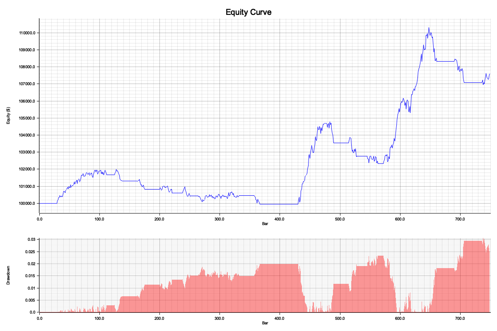

# Backtesting Emulator

An event-driven backtesting engine, written in Rust, built around one idea:
**a strategy should be structurally incapable of seeing the future.** Most
backtesting bugs come from accidentally letting a strategy trade on
information it couldn't have had yet — this engine replays market data one
bar at a time through a real event queue, so a strategy only ever sees what
has already happened, enforced by the type system and module boundaries
rather than by careful coding discipline. On top of that: realistic order
execution (slippage, commissions, limit orders, latency, partial fills),
full portfolio and risk accounting, and a standard suite of quant
performance metrics.



*MA crossover (10/30) on 750 days of synthetic daily data — 14 trades, +7.59% total return, Sharpe 1.15.*

## Quickstart

```sh
git clone <this-repo>
cd chronos-bt
cargo run --release -- run --data data/sample/spy_daily.csv --strategy ma_crossover
```

That's it — no API keys, no external data, no config file required. It
runs against a synthetic sample dataset checked into the repo
(`data/sample/spy_daily.csv`, generated by `scripts/generate_sample_data.py`),
prints a full metrics report to the terminal, and writes
`report/equity_curve.png` + `report/results.json`.

Try the other two reference strategies, or override a parameter directly:

```sh
cargo run --release -- run --data data/sample/spy_daily.csv --strategy mean_reversion
cargo run --release -- run --data data/sample/spy_daily.csv --strategy momentum --set lookback=15 --set threshold=0.03
cargo run --release -- run --data data/sample/spy_daily.csv --strategy ma_crossover --config configs/default.toml
```

## Architecture

```
DataFeed ──MarketEvent──▶ Strategy ──SignalEvent──▶ SizingModel ──OrderEvent──▶ ExecutionModel ──FillEvent──▶ Portfolio
                                                                                                                   │
                                                                                                (updates cash, positions, equity)
```

Per bar, in this exact order:

1. **Execution gets first look.** Any order resting from a *previous* bar
   attempts to fill against *this* bar's data — before the strategy even
   sees this bar. This is the mechanism (not just a convention) that
   enforces the T+1 fill rule described below.
2. **The strategy is dispatched** with a bounded window of recent history
   (a ring buffer, sized to exactly what the strategy says it needs) and
   may emit a signal expressing directional intent — long, short, or exit.
   Signals are suppressed until the strategy's declared warmup period has
   elapsed.
3. **The event queue drains**: a signal is sized into an order (a distinct
   concern from *whether* to trade — a real architectural pattern), an
   order is checked for affordability and handed to the execution model,
   and any fill updates the portfolio's cash/positions/realized PnL using
   weighted-average-cost accounting.
4. **An equity snapshot is recorded** once the queue is fully drained for
   that timestamp.

The engine (`src/engine.rs`) never holds a reference to future data — it
pulls one bar at a time from the `DataFeed` trait, and `StrategyContext`
(what a strategy is actually handed) exposes only a bounded window ending
at the current bar. There is no code path from a strategy back to the full
dataset.

## Why Backtests Lie

A backtest that looks great on paper and falls apart in production is the
default outcome, not the exception. The specific ways this happens:

**Lookahead bias.** The single most common backtesting bug: using
information a strategy couldn't have had yet — computing a signal from a
bar's closing price and then filling the trade as if it happened *at* that
close, or worse, at an even earlier price. This engine prevents it
structurally: a market order submitted while processing bar T is staged,
not filled, and only becomes eligible on the *next* bar's `on_bar` call —
there is no code path that fills against the bar that generated the order.
A dedicated test (`engine::tests::market_orders_fill_at_next_bar_open_not_current_bar_close`)
constructs a synthetic feed with a deliberate price discontinuity and
asserts the fill lands exactly where it should, and nowhere else.

**Survivorship bias.** If your historical dataset only contains companies
that still exist today, every backtest on it is implicitly cheating —
you've excluded every company that went bankrupt or got delisted, which is
exactly the outcome a real strategy needs to have handled. This engine
does not solve this: it's a property of the *data*, not the simulator, and
whatever CSV you feed it is trusted as-is. Acknowledged, not solved.

**Fill optimism.** Real orders don't fill at the price you saw when you
decided to trade — there's slippage, and large orders move the market
against themselves. `SlippageModel::None` (no cost — a useful baseline,
unrealistic for anything you'd trade with real money), `FixedBps` (a flat
spread-crossing cost), and `VolumeImpact` (cost grows with order size
relative to available volume, and caps how much can fill in one bar) are
all implemented — but they're still simplified models of real market
microstructure, not a limit order book simulation.

**Cost modeling.** It's easy to report a strategy's gross returns and
quietly ignore what trading it would actually cost. This engine tracks
commissions and slippage cost as their own explicit line items in every
report, specifically so a strategy's edge can be judged net of the friction
of actually trading it, not just its paper PnL.

**Overfitting.** Nothing about a backtesting engine can stop you from
tuning a strategy's parameters until it perfectly fits one specific
historical dataset — that's a discipline problem, not a tooling problem.
The honest mitigation is out-of-sample testing and skepticism of any result
that required a lot of parameter search to find, not a feature this engine
can provide.

## Design Decisions

**Event-driven, not vectorized.** A vectorized backtest (compute an entire
signal column across the whole price series with array operations, e.g. in
pandas/numpy) is *much* faster and is the right choice for simple
buy/sell-threshold signals swept across many parameter combinations. It
gets dangerous fast, though: it's easy to accidentally reference a future
row when computing a rolling window, and it doesn't naturally model
per-order execution mechanics (partial fills, latency, resting limit
orders) at all. Event-driven trades raw speed for *making lookahead bias
structurally hard to write* and for modeling execution realistically —
worth it for anything beyond a quick signal sanity-check.

**Single-threaded and deterministic.** No async runtime, no thread pool.
The same data, config, and (in a future version with randomized slippage)
RNG seed always produce byte-identical output — verified directly by
`tests/determinism.rs`, which runs the same backtest twice and asserts the
serialized metrics report is identical down to the byte. That property
would be much harder to guarantee with concurrent execution, and a
backtesting engine's job is to be trustworthy and reproducible before it's
fast.

**`f64` prices, not fixed-point.** Production trading systems typically
represent prices as fixed-point integers (e.g. cents, or exchange-defined
tick sizes) to get exact equality comparisons and avoid floating-point
rounding drift accumulating over millions of operations. `f64` is simpler
and is what every metric in this project (Sharpe, drawdown, etc.) needs to
work in anyway — the tradeoff is documented here rather than hidden.

## Benchmarks

Measured with `criterion` (`cargo bench`), on synthetic data, Apple M4 (10
cores, 16 GB RAM), rustc 1.96.1:

| Benchmark                       | Bars       | Time (median) | Throughput    |
|----------------------------------|-----------|----------------|----------------|
| No-op strategy (event loop only) | 1,000,000 | 67.3 ms        | 14.85 Melem/s |
| No-op strategy                   | 10,000,000| 666.5 ms       | 15.00 Melem/s |
| MA crossover (real strategy)      | 1,000,000 | 114.1 ms       | 8.76 Melem/s  |
| MA crossover                      | 10,000,000| 1.140 s        | 8.77 Melem/s  |

The no-op path — which does no strategy work at all, isolating the cost of
the event loop itself (queue draining, ring buffer maintenance, equity
snapshotting) — sustains ~15M bars/sec, comfortably in the "single-digit
millions" range this kind of engine targets. See [PERFORMANCE.md](PERFORMANCE.md)
for the full methodology: what was profiled, what was found (two costs,
each roughly 28-29% of samples — a per-bar allocation and SipHash
overhead), which one was fixed and why, and the honest before/after numbers
(MA crossover at 10M bars went from 3.06s to 1.14s — **2.7x faster** —
from that one change).

## Known Limitations

Stated plainly, not buried:

- **No margin.** Orders that would exceed available cash are rejected
  outright; there's no leverage or margin modeling.
- **No borrow cost for short positions.** Shorting is supported and
  correctly realizes PnL, but real short positions accrue a borrow fee
  this engine doesn't model.
- **Optimistic limit fills by default.** A limit order fills if the bar's
  high/low *touched* the limit price at any point — a real order book
  might not have had size available at that exact instant. A
  `LimitFillPolicy::Conservative` mode (require the bar's *close* to
  satisfy the price) is available but not the default.
- **Single asset class, single symbol per run.** No options, futures, or
  portfolio-level multi-asset optimization in v1.
- **Bar-index x-axis on the equity curve chart**, not calendar dates — a
  known simplification in the plotting code, not the metrics themselves
  (all metrics use real timestamps).
- **Survivorship bias is not addressed** — see "Why Backtests Lie" above.
  It's a property of whatever data you feed the engine.

## Correctness

Correctness is the actual point of this project, so it's tested
accordingly (84 tests, `cargo test`):

- **Lookahead prevention**: a dedicated test with a synthetic price
  discontinuity proves fills land at T+1's open, never T's close.
- **Known-answer test**: a 10-bar scenario with hand-computed expected
  cash/PnL, asserted exactly.
- **Conservation test**: `cash + position value == equity` at every step,
  across single-fill sequences and full engine runs.
- **Determinism test**: the same run, twice, produces byte-identical
  `results.json`.
- Every metric (Sharpe, Sortino, max drawdown, Calmar, trade stats) is
  tested against hand-computed values on small fixed series, not just
  "does it run."

## Project Layout

```
src/
  engine.rs          event loop, SimClock
  events.rs          Event enum and all event structs
  config.rs           TOML-loadable run configuration
  data/               CSV ingestion, Bar/SymbolId types, fast hasher
  strategy/           Strategy trait, ring-buffer context, 3 reference strategies
  execution/          ExecutionModel trait, slippage/commission/limit-fill models
  portfolio/          cash/position/equity tracking, sizing models
  metrics/            returns, drawdown, trade stats, reporting (text/PNG/JSON)
  bin/backtest.rs     the CLI
benches/               criterion throughput benchmarks
tests/                 integration tests (determinism)
scripts/               synthetic sample data generator
```
